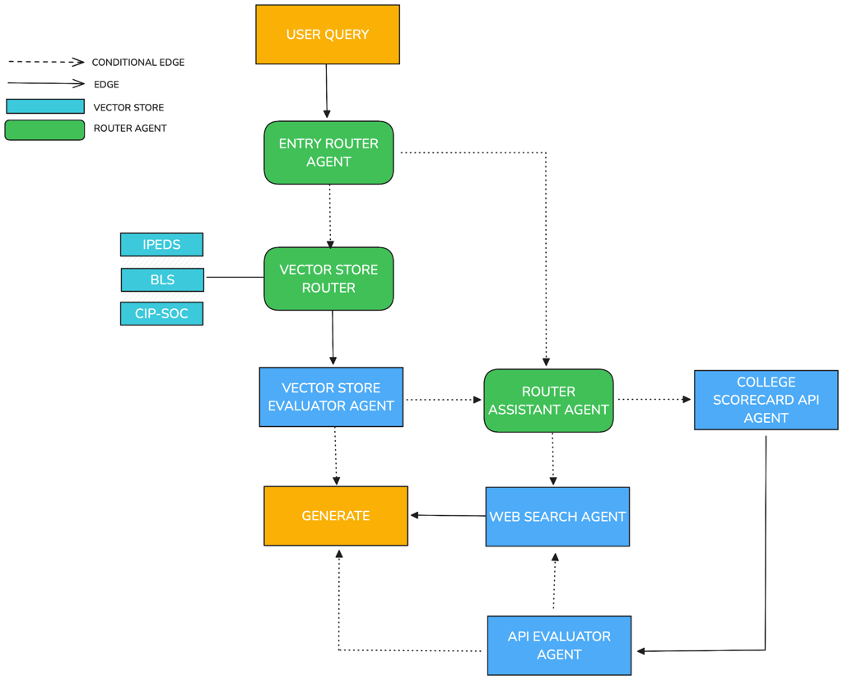

# College Wealth Wizard

The College Wealth Wizard is a novel multi-agent retrieval augmented generation (RAG) system tailored to the domain of higher education. This system harnesses the power of large language models (LLMs) to unify federal data sources on education and employment, direct user queries to appropriate data sources, and contribute to the overall transparency of postgraduate finances. Powered by langgraph, the College Wealth Wizard hosts three vector store collections, as well as several router agents to appropriately route user queries. Furthermore, the application builds upon advanced RAG frameworks such as corrective RAG by implementing multiple evaluator agents.  Through meticulous data preprocessing and chunking, each of the three vector store collections achieved a document retrieval accuracy score of 90% or above. Additionally, a test of 80 queries related to the vector stores and College Scorecard API revealed that a relevant answer was generated nearly 90% of times. Overall, the College Wealth Wizard unveils the potential for the application of multi-agent RAG in higher education and other untapped domains.  

