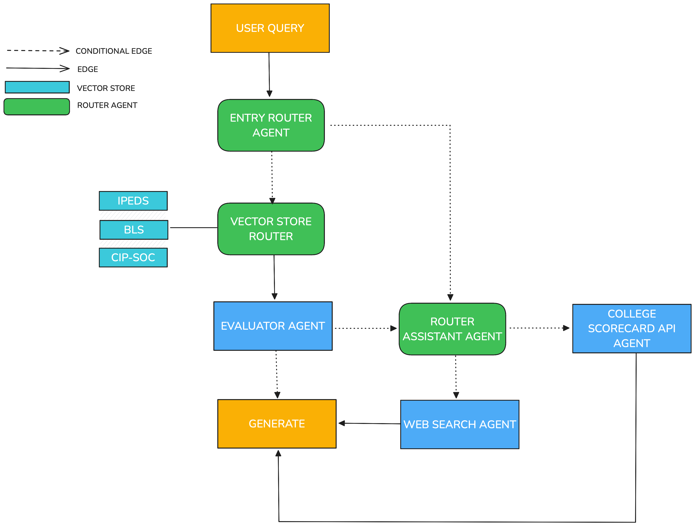

Note: Use Markdown Cheat Sheet if you need more functionality
https://www.markdownguide.org/cheat-sheet/
### Date: sep 24 2024 
- Topics of discussion
    - Project Report
    - Project repository in GitHub

- Action Items:

* [ ] Merge and finalize data for CIP-SOC database (RAG Agent)
* [ ] Create validation dataset with ChatGPT (RAG Agent)
* [ ] Generate initial accuracy metrics of RAG Agent with validation dataset
* [x] Create component level, test level, and utility level folder structure (parser, unit testing)
* [ ] Decide vector store and write code for the vector store
* [ ] Decide which LLM to use and write the code 

### Date: october 1 2024 
- Topics of discussion
    - Creating AWS instance
    - Merging and finalizing data for vector database  
  

- Notes
  - The bureau of labor statistics file is too large to merge with the additional files for the CIP-SOC database
  - An AWS instance is being set up to utilize additional computing power to merge the data sources (and support future computing needs)
  - A connection was also set up between the Pycharm project that contains the capstone files and the AWS instance
  - Began developing question-generation.py to use llamaindex to develop a RAG evaluation set

- Action Items:

* [x] Upgrade type of AWS instance 
* [x] Merge and finalize data for CIP-SOC database (RAG Agent)
* [ ] Create validation dataset with ChatGPT (RAG Agent)
* [ ] Generate initial accuracy metrics of RAG Agent with validation dataset
* [x] Decide vector store and write code for the vector store
* [ ] Decide which LLM to use and write the code 

### Date: october 8 2024 
- Topics of discussion
    - Code retrieval success rate for DuckDB (Test 100 samples)
    - Test generation after code retrieval 
    - Check embeddings from HuggingFace instead of OpenAI
    - Read about RAG for Related Work in Report
  

- Notes
  - The code for the vector store and the RAG validation dataset with a sample of the CIP-SOC data was developed
  - A larger AWS instance was developed to create the full vector store and generate a larger RAG validation dataset

- Action Items:

* [ ] Create validation dataset with ChatGPT (RAG Agent)
* [ ] Generate initial accuracy metrics of RAG Agent with validation dataset
* [ ] Decide which LLM to use and write the code 
* [x] Generate code retrieval success rate for DuckDB
* [ ] Read about RAG for Related Work in Report
* [x] Change embeddings for vector store to something from Hugging Face
* [ ] Clean up scripts and add testing scripts for every module (retrieval, LLM, and embeddings)

### Date: october 17 2024 
- Topics of discussion
  - Chroma vector store upload speed
  - RAG Chain with mistralai
  

- Notes
  - I switched the embedding model from OpenAI to HuggingFace
  - I also switched the vector store from DuckDB to Chroma 
  - I was able to get initial metrics for the Chroma vector store code retrieval and it was highly successful
  - I was able to add all of the BLS data to the vector store and create a RAG chain using mistralai
  - I have only added a sample of the IPEDS data to the vector store. The IPEDs document object is very large and takes a while to be added
    - In order to speed up the process, I eliminated unnecessary columns and combined similar columns.
    - I have also tried asynchronous batch uploading to speed up the process. To date, it still takes ~3 hours
 

- Action Items:

* [ ] Create validation dataset with ChatGPT (RAG Agent)
* [ ] Generate initial accuracy metrics of RAG Agent with validation dataset
* [x] Decide which LLM to use and write the code 
* [ ] Read about RAG for Related Work in Report
* [ ] Clean up scripts and add testing scripts for every module (retrieval, LLM, and embeddings)

### Date: october 22 2024 
- Topics of discussion
  - RAG retrieval metrics

- Notes
  - In addition to generating accuracy metrics for RAG retrievals, we also discussed providing wrong answers to the LLM and ensuring it generates answers from the vector stores and not itself

- Action Items:

* [x] Create validation datasets for IPEDs, BLS, and CIP_SOC crosswalk files
* [ ] Generate accuracy metrics of RAG with validation datasets
* [ ] Test that generated answers from LLM are from vector stores and not LLM itself
* [ ] Read about RAG for Related Work in Report
* [ ] Clean up scripts and add testing scripts for every module (retrieval, LLM, and embeddings)

### Date: october 29 2024 
- Topics of discussion
  - RAG retrieval metrics
  - Test scripts

- Notes
  - Initial accuracy metrics were 18% for BLS dataset, 64% for IPEDs dataset, and 33% for CIP-SOC association dataset when retrieving 5 documents per query
  - When retrieving 10 documents to query, the respective metrics were 19% for BLS, 64% for IPEDs, and 41%  for XWalk
  - I analyzed the results and figured out the BLS data was duplicated on several columns that were dropped. I reprocessed this data as well as the CIP-SOC association dataset. 
  - After calculating the average length of each document, changing the chunking size, and changing the embedding model to 'BAAI/bge-large-en-v1.5', I received accuracy scores of 100, 100, 96 on random samples of 25 from the BLS, IPEDs, and CIP-SOC dataset respectively. 
  - I added a test script for calculating the accuracy of retrieval from the vector store 

- Action Items:

* [x] Create validation datasets for IPEDs, BLS, and CIP_SOC crosswalk files
* [x] Generate accuracy metrics of RAG with validation datasets
* [ ] Test that generated answers from LLM are from vector stores and not LLM itself
* [ ] Read about RAG for Related Work in Report
* [ ] Clean up scripts and add testing scripts for every module (retrieval, LLM, and embeddings)

### Date: november 5 2024 

#### Accuracy Metrics of Vector Store Retrieval
| Dataset | Description of Dataset                                                                                                                                                                                                                                  | # of RAG Questions | # of Documents Retrieved | Accuracy of Correct Document Retrieval | Accuracy of Correct Chunk and Document Retrieval |
|--------|---------------------------------------------------------------------------------------------------------------------------------------------------------------------------------------------------------------------------------------------------------|--------------------|--------------------------|----------------------------------------| ----------------------------| 
| IPEDs | The Integrated Postsecondary Education Data System (IPEDS) dataset is an extract from the IPEDs data portal. The extract contains information on housing, federal aid, and loans for over 4,000 accredited institutions in the United States.           | 100                | 5 | 90%                                    | 90% |
| BLS | The U.S. Bureau of Labor Statistics (BLS) dataset is an extract of occupational data in the United States. It contains mean wages and total employment information for occupations as defined by the Standard Occupational Classification (SOC) system. | 100                |  5 | 90%                                    | ~70% |
| CIP-SOC Associations | The CIP-SOC associations dataset is a dataset that links the Classification of Instructional Programs (CIP) code of a given university field of study to its associated occupation as defined by the Standard Occupational Classification (SOC) system. | 95                 |  5 | 95%                                    | 95% |

| LLM for QA Generation | Prompt for QA Generation | LLM for Vector Store Embeddings | Vector Store |
| --------------------- | ------------------------ | ------------------------------- |------------|
| mistralai/Mixtral-8x7B-Instruct-v0.1 | - Your task is to write a factoid question and an answer given a context.   Your factoid question should be answered with a specific, concise piece of factual information from the context.   Your factoid question should be formulated in the same style as questions users could ask in a search engine.  This means that your factoid question MUST NOT mention something like "according to the passage" or "context".   Provide your answer as follows:     Output:::  Factoid question: (your factoid question)  Answer: (your answer to the factoid question)   Now here is the context.    Context: {context}\n  Output::: | BAAI/bge-large-en-v1.5 | Chroma     |

#### Examples of Correct Document Retrieval
| Dataset| Question| Original Context | Retrieved Context|
|-------------------|---------------------------------|----------------|-------------------------------|
| IPEDs             | *What is the average amount of federal grant aid awarded to full-time first-time undergraduates at Brewton-Parker College?*  | The aid information for "Brewton-Parker College" is as follows: The average amount of federal  state  local or institutional grant aid awarded (sfa2122) at Brewton-Parker College is 14497.0. The average amount of federal grant aid awarded to full-time first-time undergraduates (sfa2122) at Brewton-Parker College is 6522.0. The average amount of pell grant aid awarded to full-time first-time undergraduates (sfa2122) at Brewton-Parker College is 5010.0. The average amount of other federal grant aid awarded to full-time first-time undergraduates (sfa2122) at Brewton-Parker College is 2785.0. The average amount of state/local grant aid awarded to full-time first-time undergraduates (sfa2122) at Brewton-Parker College is 2408.0. The average amount of institutional grant aid awarded to full-time first-time undergraduates (sfa2122) at Brewton-Parker College is 7631.0. The average amount of student loans awarded to full-time first-time undergraduates (sfa2122) at Brewton-Parker College is 5709.0. The average amount of other student loans awarded to full-time first-time undergraduates (sfa2122) at Brewton-Parker College is 10290.0. The average amount of federal  state  local  institutional or other sources of grant aid awarded to undergraduate students (sfa2122) at Brewton-Parker College is 10480.0. The average amount pell grant aid awarded to undergraduate students (sfa2122) at Brewton-Parker College is 5220.0. The average amount of federal student loans awarded to undergraduate students (sfa2122) at Brewton-Parker College is 6329.0. The average amount of federal  state  local  institutional or other sources of grant aid awarded to degree/certificate-seeking undergraduate students (sfa2122) at Brewton-Parker College is 14716.0. The average amount of federal  state  local  institutional or other sources of grant aid awarded to non-degree/non-certificate-seeking undergraduates (sfa2122) at Brewton-Parker College is 1833.0. | - 'The aid information for "Brewton-Parker College" is as follows: The average amount of federal  state  local or institutional grant aid awarded (sfa2122) at Brewton-Parker College is 14497.0. The average amount of federal grant aid awarded to full-time first-time undergraduates (sfa2122) at Brewton-Parker College is 6522.0. The average amount of pell grant aid awarded to full-time first-time undergraduates (sfa2122) at Brewton-Parker College is 5010.0. The average amount of other federal grant aid awarded to full-time first-time undergraduates (sfa2122) at Brewton-Parker College is 2785.0. The average amount of state/local grant aid awarded to full-time first-time undergraduates (sfa2122) at Brewton-Parker College is 2408.0. The average amount of institutional grant aid awarded to full-time first-time undergraduates (sfa2122) at Brewton-Parker College is 7631.0. The average amount of student loans awarded to full-time first-time undergraduates (sfa2122) at Brewton-Parker College is 5709.0. The average amount of other student loans awarded to full-time first-time undergraduates (sfa2122) at Brewton-Parker College is 10290.0. The average amount of federal  state  local  institutional or other sources of grant aid awarded to undergraduate students (sfa2122) at Brewton-Parker College is 10480.0. The average amount pell grant aid awarded to undergraduate students (sfa2122) at Brewton-Parker College is 5220.0. The average amount of federal student loans awarded to undergraduate students (sfa2122) at Brewton-Parker College is 6329.0. The average amount of federal  state  local  institutional or other sources of grant aid awarded to degree/certificate-seeking undergraduate students (sfa2122) at Brewton-Parker College is 14716.0. The average amount of federal  state  local  institutional or other sources of grant aid awarded to non-degree/non-certificate-seeking undergraduates (sfa2122) at Brewton-Parker College is 1833.0.'    -'The average net price information at "Brewton-Parker College" is as follows: The average net price-students awarded grant or scholarship aid  2021-22 (sfa2122) at Brewton-Parker College is 21874.0. The average net price (income 0-30 000)-students awarded title iv federal financial aid  2021-22 (sfa2122) at Brewton-Parker College is 20398.0. The average net price (income 30 001-48 000)-students awarded title iv federal financial aid  2021-22 (sfa2122) at Brewton-Parker College is 20378.0. The average net price (income 48 001-75 000)-students awarded title iv federal financial aid  2021-22 (sfa2122) at Brewton-Parker College is 23217.0. The average net price (income 75 001-110 000)-students awarded title iv federal financial aid  2021-22 (sfa2122) at Brewton-Parker College is 24265.0. The average net price (income over 110 000)-students awarded title iv federal financial aid  2021-22 (sfa2122) at Brewton-Parker College is 24873.0.'    -'The aid information for "Parker University" is as follows: The average amount of federal  state  local or institutional grant aid awarded (sfa2122) at Parker University is 7322.0. The average amount of federal grant aid awarded to full-time first-time undergraduates (sfa2122) at Parker University is 4670.0. The average amount of pell grant aid awarded to full-time first-time undergraduates (sfa2122) at Parker University is 4461.0. The average amount of other federal grant aid awarded to full-time first-time undergraduates (sfa2122) at Parker University is 1667.0. The average amount of state/local grant aid awarded to full-time first-time undergraduates (sfa2122) at Parker University is unavailable. The average amount of institutional grant aid awarded to full-time first-time undergraduates (sfa2122) at Parker University is 5050.0. The average amount of student loans awarded to full-time first-time undergraduates (sfa2122) at Parker University is 7330.0. The average amount of other student loans awarded to full-time first-time undergraduates (sfa2122) at Parker University is unavailable. The average amount of federal  state  local  institutional or other sources of grant aid awarded to undergraduate students (sfa2122) at Parker University is 8078.0. The average amount pell grant aid awarded to undergraduate students (sfa2122) at Parker University is 5134.0. The average amount of federal student loans awarded to undergraduate students (sfa2122) at Parker University is 9834.0. The average amount of federal  state  local  institutional or other sources of grant aid awarded to degree/certificate-seeking undergraduate students (sfa2122) at Parker University is 8078.0. The average amount of federal  state  local  institutional or other sources of grant aid awarded to non-degree/non-certificate-seeking undergraduates (sfa2122) at Parker University is unavailable.'    -'The aid information for "Porter & Chester Institute" is as follows: The average amount of federal  state  local or institutional grant aid awarded (sfa2122) at Porter & Chester Institute is 6660.0. The average amount of federal grant aid awarded to full-time first-time undergraduates (sfa2122) at Porter & Chester Institute is 7171.0. The average amount of pell grant aid awarded to full-time first-time undergraduates (sfa2122) at Porter & Chester Institute is 6815.0. The average amount of other federal grant aid awarded to full-time first-time undergraduates (sfa2122) at Porter & Chester Institute is 494.0. The average amount of state/local grant aid awarded to full-time first-time undergraduates (sfa2122) at Porter & Chester Institute is 5000.0. The average amount of institutional grant aid awarded to full-time first-time undergraduates (sfa2122) at Porter & Chester Institute is 1907.0. The average amount of student loans awarded to full-time first-time undergraduates (sfa2122) at Porter & Chester Institute is 9620.0. The average amount of other student loans awarded to full-time first-time undergraduates (sfa2122) at Porter & Chester Institute is 3948.0. The average amount of federal  state  local  institutional or other sources of grant aid awarded to undergraduate students (sfa2122) at Porter & Chester Institute is 5483.0. The average amount pell grant aid awarded to undergraduate students (sfa2122) at Porter & Chester Institute is 4952.0. The average amount of federal student loans awarded to undergraduate students (sfa2122) at Porter & Chester Institute is 7923.0. The average amount of federal  state  local  institutional or other sources of grant aid awarded to degree/certificate-seeking undergraduate students (sfa2122) at Porter & Chester Institute is 5483.0. The average amount of federal  state  local  institutional or other sources of grant aid awarded to non-degree/non-certificate-seeking undergraduates (sfa2122) at Porter & Chester Institute is unavailable.'    -'The aid information for "Bard College" is as follows: The average amount of federal  state  local or institutional grant aid awarded (sfa2122) at Bard College is 53584.0. The average amount of federal grant aid awarded to full-time first-time undergraduates (sfa2122) at Bard College is 3388.0. The average amount of pell grant aid awarded to full-time first-time undergraduates (sfa2122) at Bard College is 5441.0. The average amount of other federal grant aid awarded to full-time first-time undergraduates (sfa2122) at Bard College is 827.0. The average amount of state/local grant aid awarded to full-time first-time undergraduates (sfa2122) at Bard College is 3016.0. The average amount of institutional grant aid awarded to full-time first-time undergraduates (sfa2122) at Bard College is 52495.0. The average amount of student loans awarded to full-time first-time undergraduates (sfa2122) at Bard College is 6006.0. The average amount of other student loans awarded to full-time first-time undergraduates (sfa2122) at Bard College is 22355.0. The average amount of federal  state  local  institutional or other sources of grant aid awarded to undergraduate students (sfa2122) at Bard College is 49591.0. The average amount pell grant aid awarded to undergraduate students (sfa2122) at Bard College is 5273.0. The average amount of federal student loans awarded to undergraduate students (sfa2122) at Bard College is 6415.0. The average amount of federal  state  local  institutional or other sources of grant aid awarded to degree/certificate-seeking undergraduate students (sfa2122) at Bard College is 49591.0. The average amount of federal  state  local  institutional or other sources of grant aid awarded to non-degree/non-certificate-seeking undergraduates (sfa2122) at Bard College is unavailable.' |
| BLS               | *What is the total employment for the "Office and Administrative Support Workers, All Other" occupation in the "Cross-industry, Private Ownership only" industry?* | The total employment nationwide is 94910.0 for the "Office and Administrative Support Workers, All Other" occupation in the "Cross-industry, Private Ownership only" industry | - 'The total employment nationwide is 94910.0 for the "Office and Administrative Support Workers, All Other" occupation in the "Cross-industry, Private Ownership only" industry'    -'The total employment nationwide is 2029260.0 for the "Office Clerks, General" occupation in the "Cross-industry, Private Ownership only" industry'    -'The total employment nationwide is 25030.0 for the "Office Machine Operators, Except Computer" occupation in the "Cross-industry, Private Ownership only" industry'    -'The total employment nationwide is 702060.0 for the "Medical Secretaries and Administrative Assistants" occupation in the "Cross-industry, Private Ownership only" industry'    -'The total employment nationwide is 965920.0 for the "Receptionists and Information Clerks" occupation in the "Cross-industry, Private Ownership only" industry'|
| CIP-SOC Crosswalk | *What careers are associated with the Materials Sciences, Other field of study?*                             | For the "Materials Sciences, Other." field of study, the associated career paths are as follows: Natural Sciences Managers, Materials Scientists, Postsecondary Teachers, All Other | -'For the "Materials Sciences, Other." field of study, the associated career paths are as follows: Natural Sciences Managers, Materials Scientists, Postsecondary Teachers, All Other'    -'For the "Materials Science." field of study, the associated career paths are as follows: Architectural and Engineering Managers, Materials Scientists, Life, Physical, and Social Science Technicians, All Other, Engineering Teachers, Postsecondary'    -'For the "Materials Chemistry." field of study, the associated career paths are as follows: Natural Sciences Managers, Chemists, Materials Scientists, Life, Physical, and Social Science Technicians, All Other, Chemistry Teachers, Postsecondary'    -'For the "Ceramic Sciences and Engineering." field of study, the associated career paths are as follows: Architectural and Engineering Managers, Chemical Engineers, Materials Engineers, Engineering Teachers, Postsecondary'    -'For the "Materials Engineering." field of study, the associated career paths are as follows: Architectural and Engineering Managers, Cost Estimators, Materials Engineers, Engineering Teachers, Postsecondary'|

#### Examples of Incorrect Document Retrieval
| Dataset| Question| Original Context | Retrieved Context|
|-------------------|---------------------------------|----------------|-------------------------------|
| IPEDs             | *What is the typical food charge for an academic year (ic2023) at Chamberlain University-Virginia?*  | The housing information for "Chamberlain University-Virginia" is as follows: The on campus  food and housing 2023-24 (ic2023_ay) at Chamberlain University-Virginia is unavailable. The off campus (not with family)  food and housing 2023-24 (ic2023_ay) at Chamberlain University-Virginia is 16724.0. The on campus  food and housing 2020-21 (ic2023_ay) at Chamberlain University-Virginia is unavailable. The institutionally-controlled housing at Chamberlain University-Virginia is not provided by the institution. The typical housing charges for an academic year (ic2023) at Chamberlain University-Virginia is unavailable. The typical food charge for academic year (ic2023) at Chamberlain University-Virginia is unavailable. | - 'The housing information for "University of Virginia-Main Campus" is as follows: The on campus  food and housing 2023-24 (ic2023_ay) at University of Virginia-Main Campus is 13940.0. The off campus (not with family)  food and housing 2023-24 (ic2023_ay) at University of Virginia-Main Campus is 13940.0. The on campus  food and housing 2020-21 (ic2023_ay) at University of Virginia-Main Campus is 12350.0. The institutionally-controlled housing at University of Virginia-Main Campus is provided by the institution. The typical housing charges for an academic year (ic2023) at University of Virginia-Main Campus is 8230.0. The typical food charge for academic year (ic2023) at University of Virginia-Main Campus is 6470.0.'    - 'The housing information for "Virginia State University" is as follows: The on campus  food and housing 2023-24 (ic2023_ay) at Virginia State University is 12966.0. The off campus (not with family)  food and housing 2023-24 (ic2023_ay) at Virginia State University is 15068.0. The on campus  food and housing 2020-21 (ic2023_ay) at Virginia State University is 11544.0. The institutionally-controlled housing at Virginia State University is provided by the institution. The typical housing charges for an academic year (ic2023) at Virginia State University is 7474.0. The typical food charge for academic year (ic2023) at Virginia State University is 5492.0.'    - 'The housing information for "Virginia Polytechnic Institute and State University" is as follows: The on campus  food and housing 2023-24 (ic2023_ay) at Virginia Polytechnic Institute and State University is 14888.0. The off campus (not with family)  food and housing 2023-24 (ic2023_ay) at Virginia Polytechnic Institute and State University is 12578.0. The on campus  food and housing 2020-21 (ic2023_ay) at Virginia Polytechnic Institute and State University is 9556.0. The institutionally-controlled housing at Virginia Polytechnic Institute and State University is provided by the institution. The typical housing charges for an academic year (ic2023) at Virginia Polytechnic Institute and State University is 6520.0. The typical food charge for academic year (ic2023) at Virginia Polytechnic Institute and State University is 5998.0.'    - 'The housing information for "University of Virginia\'s College at Wise" is as follows: The on campus  food and housing 2023-24 (ic2023_ay) at University of Virginia\'s College at Wise is 12535.0. The off campus (not with family)  food and housing 2023-24 (ic2023_ay) at University of Virginia\'s College at Wise is 10225.0. The on campus  food and housing 2020-21 (ic2023_ay) at University of Virginia\'s College at Wise is 11277.0. The institutionally-controlled housing at University of Virginia\'s College at Wise is provided by the institution. The typical housing charges for an academic year (ic2023) at University of Virginia\'s College at Wise is 7058.0. The typical food charge for academic year (ic2023) at University of Virginia\'s College at Wise is 5299.0.'    - 'The housing information for "Virginia Military Institute" is as follows: The on campus  food and housing 2023-24 (ic2023_ay) at Virginia Military Institute is 10990.0. The off campus (not with family)  food and housing 2023-24 (ic2023_ay) at Virginia Military Institute is unavailable. The on campus  food and housing 2020-21 (ic2023_ay) at Virginia Military Institute is 10060.0. The institutionally-controlled housing at Virginia Military Institute is provided by the institution. The typical housing charges for an academic year (ic2023) at Virginia Military Institute is 3290.0. The typical food charge for academic year (ic2023) at Virginia Military Institute is 7700.0.' |
| BLS               | *How many budget analysts are employed in the real estate and rental and leasing industry in the US?* | The total employment nationwide is 220.0 for the "Budget Analysts" occupation in the "Real Estate and Rental and Leasing" industry | - 'The total employment nationwide is 7250.0 for the "Financial and Investment Analysts" occupation in the "Real Estate and Rental and Leasing" industry'    -'The total employment nationwide is 22180.0 for the "Market Research Analysts and Marketing Specialists" occupation in the "Real Estate and Rental and Leasing" industry'    -'The total employment nationwide is 1320.0 for the "Computer Systems Analysts" occupation in the "Real Estate and Rental and Leasing" industry'    -'The total employment nationwide is 48970.0 for the "Accountants and Auditors" occupation in the "Real Estate and Rental and Leasing" industry'    -'The total employment nationwide is 420.0 for the "Software Quality Assurance Analysts and Testers" occupation in the "Real Estate and Rental and Leasing" industry'|
| CIP-SOC Crosswalk | *What careers are associated with the Caribbean Studies field of study?*                             | For the "Caribbean Studies." field of study, the associated career paths are as follows: Area, Ethnic, and Cultural Studies Teachers, Postsecondary | - 'For the "Maritime Studies." field of study, the associated career paths are as follows: Historians, Postsecondary Teachers, All Other'    -'For the "African-American/Black Studies." field of study, the associated career paths are as follows: Area, Ethnic, and Cultural Studies Teachers, Postsecondary'    -'For the "Commonwealth Studies." field of study, the associated career paths are as follows: Area, Ethnic, and Cultural Studies Teachers, Postsecondary'    -'For the "Canadian Studies." field of study, the associated career paths are as follows: Area, Ethnic, and Cultural Studies Teachers, Postsecondary'    -'For the "African Studies." field of study, the associated career paths are as follows: Area, Ethnic, and Cultural Studies Teachers, Postsecondary'|

#### Examples of LangGraph Workflow
| Query                                                                           | Graph State                                                                                                                                              | Answer | Documents/Information Retrieved | 
|---------------------------------------------------------------------------------|----------------------------------------------------------------------------------------------------------------------------------------------------------| ----- | ----- | 
| *What is the undergraduate application fee for West Virginia Wesleyan College?* | ---ROUTE QUESTION---   ---ROUTE QUESTION TO IPEDS VECTOR STORE---   ---RETRIEVE IPEDS DOCUMENTS---   ---GENERATE RESPONSE---     | The undergraduate application fee for West Virginia Wesleyan College is 35.0. | 'documents': [Document(metadata={'chunk': 4, 'row': 5796, 'source': 'IPEDs Data Extract'}, page_content='The application fee information for "West Virginia Wesleyan College" is as follows: The undergraduate application fee (ic2023) at West Virginia Wesleyan College is 35.0. The graduate application fee (ic2023) at West Virginia Wesleyan College is 50.0.'), Document(metadata={'chunk': 4, 'row': 5792, 'source': 'IPEDs Data Extract'}, page_content='The application fee information for "West Virginia University" is as follows: The undergraduate application fee (ic2023) at West Virginia University is 50.0. The graduate application fee (ic2023) at West Virginia University is 60.0.'), Document(metadata={'chunk': 4, 'row': 5786, 'source': 'IPEDs Data Extract'}, page_content='The application fee information for "West Virginia Junior College-Morgantown" is as follows: The undergraduate application fee (ic2023) at West Virginia Junior College-Morgantown is 25.0. The graduate application fee (ic2023) at West Virginia Junior College-Morgantown is unavailable.'), Document(metadata={'chunk': 4, 'row': 5677, 'source': 'IPEDs Data Extract'}, page_content='The application fee information for "Virginia Wesleyan University" is as follows: The undergraduate application fee (ic2023) at Virginia Wesleyan University is 0.0. The graduate application fee (ic2023) at Virginia Wesleyan University is 0.0.')] | 
| *How many data scientists are employed in the Information industry?*               | ---ROUTE QUESTION---   ---ROUTE QUESTION TO BLS VECTOR STORE---   ---RETRIEVE BLS DOCUMENTS---   ---GENERATE RESPONSE---         |   The context provides that the total employment for data scientists in the Information industry is 22240.0. |  'documents':  [Document(metadata={'chunk': 1, 'row': 12218, 'source': 'BLS Data Extract'}, page_content='The total employment nationwide is 22240.0 for the "Data Scientists" occupation in the "Information" industry.. The SOC code for the "Data Scientists" occupation within the "Information" industry is 152051'), Document(metadata={'chunk': 1, 'row': 12296, 'source': 'BLS Data Extract'}, page_content='The total employment nationwide is 8080.0 for the "Data Scientists" occupation in the "Software Publishers" industry.. The SOC code for the "Data Scientists" occupation within the "Software Publishers" industry is 152051'), Document(metadata={'chunk': 1, 'row': 12297, 'source': 'BLS Data Extract'}, page_content='The total employment nationwide is 40.0 for the "Data Scientists" occupation in the "Sound Recording Industries" industry.. The SOC code for the "Data Scientists" occupation within the "Sound Recording Industries" industry is 152051'), Document(metadata={'chunk': 1, 'row': 12308, 'source': 'BLS Data Extract'}, page_content='The total employment nationwide is 1400.0 for the "Data Scientists" occupation in the "Telecommunications" industry.. The SOC code for the "Data Scientists" occupation within the "Telecommunications" industry is 152051'), Document(metadata={'chunk': 1, 'row': 12222, 'source': 'BLS Data Extract'}, page_content='The total employment nationwide is 700.0 for the "Data Scientists" occupation in the "Legal Services" industry.. The SOC code for the "Data Scientists" occupation within the "Legal Services" industry is 152051')]| 
| *What career paths can I pursue for a field of study in biology?*               | ---ROUTE QUESTION---   ---ROUTE QUESTION TO CIP-SOC VECTOR STORE---   ---RETRIEVE CIP-SOC DOCUMENTS---   ---GENERATE RESPONSE--- |  Based on the provided contexts, you can pursue career paths such as Natural Sciences Managers, Zoologists and Wildlife Biologists, Biological Technicians, Biological Science Teachers, Postsecondary, Biological Scientists, All Other, Conservation Scientists, Life Scientists, All Other for various fields of study within biology, including Zoology/Animal Biology, Environmental Biology, and Biological and Biomedical Sciences, Other.' |  'documents':  [Document(metadata={'chunk': 1, 'row': 719, 'source': 'CIP-SOC Associations'}, page_content='For the "Zoology/Animal Biology, Other." field of study, the associated career paths are as follows: Natural Sciences Managers, Zoologists and Wildlife Biologists, Biological Science Teachers, Postsecondary'), Document(metadata={'chunk': 1, 'row': 714, 'source': 'CIP-SOC Associations'}, page_content='For the "Zoology/Animal Biology." field of study, the associated career paths are as follows: Natural Sciences Managers, Zoologists and Wildlife Biologists, Biological Technicians, Biological Science Teachers, Postsecondary'), Document(metadata={'chunk': 1, 'row': 759, 'source': 'CIP-SOC Associations'}, page_content='For the "Environmental Biology." field of study, the associated career paths are as follows: Zoologists and Wildlife Biologists, Biological Scientists, All Other, Conservation Scientists, Biological Science Teachers, Postsecondary'), Document(metadata={'chunk': 1, 'row': 773, 'source': 'CIP-SOC Associations'}, page_content='For the "Biological and Biomedical Sciences, Other." field of study, the associated career paths are as follows: Natural Sciences Managers, Biological Scientists, All Other, Life Scientists, All Other, Biological Science Teachers, Postsecondary')]| 
| *How many universities are located in the District of Columbia?*                | ---ROUTE QUESTION---   ---ROUTE QUESTION TO WEB SEARCH---   ---WEB SEARCH---   ---GENERATE RESPONSE---                           |  According to the context provided, there are at least 8 universities located in the District of Columbia: American University, The Catholic University of America, Corcoran College of Art & Design, Gallaudet University, George Washington University, Georgetown University, Howard University, and The University of the District of Columbia (UDC). |  'documents': [Document(metadata={}, page_content="Below you'll find a comprehensive directory of the 4-year colleges, universities and higher education institutions located in the District of Columbia. American University. The Catholic University of America. Corcoran College of Art & Design. Gallaudet University. George Washington University. Georgetown University. Howard University.\nSeveral top colleges and universities are located in the Washington, D.C. area, and the nation's capital is a particularly good place to study for students interested in pursuing fields such as political science, government, and international relations. ... Like many schools in the District of Columbia, the university has international focus\n2025 Best Colleges in the District of Columbia Several National Universities are located in Washington, D.C., and many host renowned political science and public affairs programs.\nList of District of Columbia Colleges. Size-wise, the largest colleges by undergraduate student body are the Strayer University (40,000) and the George Washington University (10,465). While the smallest establishments include National Intelligence University (25) and the Corcoran College of Art & Design (385).\nThe University of the District of Columbia (UDC) is a public historically black land-grant university in Washington, D.C. It was established in 1851 and is the only public university in the city. UDC is a member school of the Thurgood Marshall College Fund.The full university system offers workforce and certificate programs in addition to Associate, Baccalaureate, Master's, professional, and")]| 

### Date: november 19 2024 

#### Current Application Design

#### Current Agents and Tools
| Agent                     | Description                                                                                            | Tools                                                      | Prompt      |
|---------------------------|--------------------------------------------------------------------------------------------------------|------------------------------------------------------------|-------------|
| **Entry Router Agent**    | Routes the user query to the Vector Store Router or the Assistant Router Agent                         | N/A                                                        | PROMPT HERE  |
| **Vector Store Router**   | Chooses a relevant vector store to route the user query to and retrieves documents                     | IPEDs vector store, BLS vector store, CIP-SOC vector store | PROMPT HERE  |
| **Evaluator Agent**       | Asseses whether the retrieved documents from the vector store are suffifient to answer the user query. | N/A                                                        | PROMPT HERE  |
| **Assitant Router Agent** | Routes the user query to the College Scorecard API or the Tavily Web Search                            | College Scorecard API, Tavily Web Search                   | PROMPT HERE |

#### Sample Workflow

| Query | Application State | Answer |
| ----- | ----------------- | ------ |
| How much money do students at George Washington University make six years after graduation? | ---DIRECTING USER QUERY TO {'datasource': 'routing assistant'}---  ---ASSISTANT ROUTING AGENT ANALYZING QUERY---  --- ASSISTANT ROUTING AGENT SENDING QUERY TO "College Scorecard API"---  ---NEXT STEP IS College Scorecard API---  ---PARSING QUERY TO API PARAMETERS---  ---CONTACTING API WITH PARAMETERS---  ---GENERATE--- |  '\nAnswer: The median salary for students six years after graduation from George Washington University is $71,607.' | 
| What jobs are associated with a degree in data science? | ---DIRECTING USER QUERY TO {'datasource': 'vector store'}---  ---ROUTE QUESTION---  ---QUESTION ROUTED TO ['CIP_SOC vector store']---  ---RETRIEVE DOCUMENTS FROM CIP_SOC VECTOR STORE---  ---EVALUATING IF DOCUMENTS SUFFICIENT FOR GENERATION---  ---EVALUATOR AGENT SAYS "{'relevance': 'generate'}"---  ---NEXT STEP IS generate---  ---ASSISTANT ROUTING AGENT ANALYZING QUERY---  --- ASSISTANT ROUTING AGENT SENDING QUERY TO "web_search"---  ---NEXT STEP IS web_search---  ---WEB SEARCH---  ---GENERATE---|  Based on the provided contexts from the CIP-SOC Associations, jobs associated with a degree in data science, data analytics (general or other), or data science (general or other) include Computer and Information Systems Managers, Natural Sciences Managers, Computer and Information Research Scientists, Database Architects, Software Developers, Statisticians, Data Scientists, Postsecondary Teachers, and All Other careers.\n\nAdditionally, according to the article from Coursera, data science careers include Data Scientist, Machine Learning Engineer, and Data Analyst. Each position requires different responsibilities and skills to master. Data scientists find, clean, and organize data for companies, and use different techniques, algorithms, and tools to extract insights and knowledge from both structured and unstructured data. Machine Learning Specialists use machine learning to better understand their data, while Machine Learning Engineers turn machine learning models into products that end users can engage with.\n\nThese careers can help you make a strategic career decision if you are interested in analyzing data to figure out why things happen and find big-picture solutions to problems or work with artificial intelligence (AI) and machine learning. As you progress along your path, you'll build projects to build a portfolio and earn a certificate to help you land a job. | 

