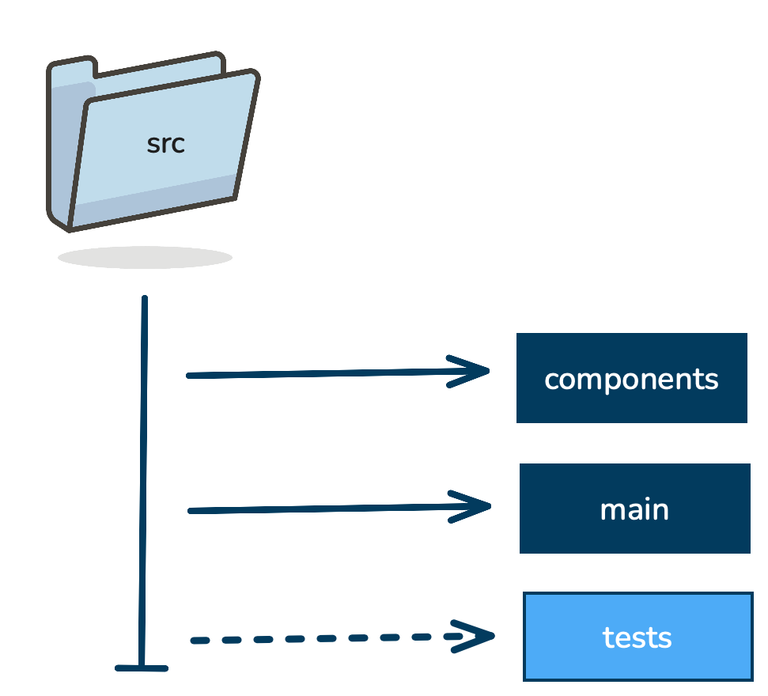

# College Wealth Wizard Code Structure

### Components Folder
- The components folder contains modules for the College Wealth Wizard. 
- The modules are divided into three groups: RAG, retrieval, and preprocess.
- The preprocess module contains functions to process IPEDs and BLS data as well as generate document objects.
- The retrieval module contains functions to generate a vector store as well as retrieve documents from vector stores.
- The RAG module contains functions to create a RAG validation set as well as prompt an LLM with RAG. 

### Main Folder

### Tests Folder
